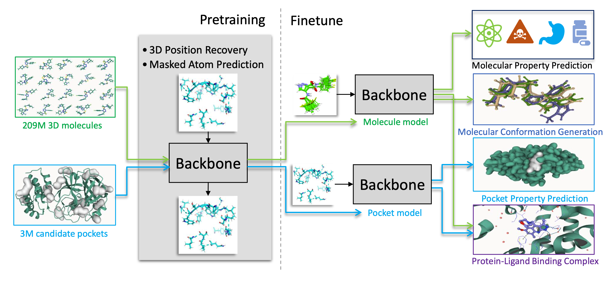

Uni-Mol: A Universal 3D Molecular Representation Learning Framework 
===================================================================

[[Paper](https://openreview.net/forum?id=6K2RM6wVqKu)], [[Uni-Mol Docking Colab](https://colab.research.google.com/github/deepmodeling/Uni-Mol/blob/main/unimol/notebooks/unimol_binding_pose_demo.ipynb)]

Authors: Gengmo Zhou, Zhifeng Gao, Qiankun Ding, Hang Zheng, Hongteng Xu, Zhewei Wei, Linfeng Zhang, Guolin Ke 

Uni-Mol is a universal 3D molecular pretraining framework that significantly enlarges the representation ability and application scope in drug design. 

<p align="center"></p>
<p align="center"><b>Schematic illustration of the Uni-Mol framework</b></p>

Uni-Mol comprises two models: a molecular pretraining model that has been trained using 209M molecular 3D conformations, and a pocket pretraining model that has been trained using 3M candidate protein pocket data. These two models can be used independently for different tasks and are combined for protein-ligand binding tasks. Uni-Mol has demonstrated superior performance compared to the state-of-the-art (SOTA) in 14 out of 15 molecular property prediction tasks. Moreover, Uni-Mol has achieved exceptional accuracy in 3D spatial tasks, such as protein-ligand binding pose prediction and molecular conformation generation.


How to get features
------------------------------

```bash
CUDA_VISIBLE_DEVICES="0" python ./unimol/infer_feature.py --user-dir ./unimol $data_path --results-path $output_dir --num-workers 8 --batch-size 1 --task mol_finetune --task-name $data_subset --num-classes 128 --loss finetune_cross_entropy  --arch unimol_base --path $ckpt_path --only-polar 0 --dict-name 'dict.txt' --conf-size 11 --log-interval 50 --log-format simple --valid-subset test,train,valid --fp16 --fp16-init-scale 4 --fp16-scale-window 256 --classification-head-name None --mode infer

```
